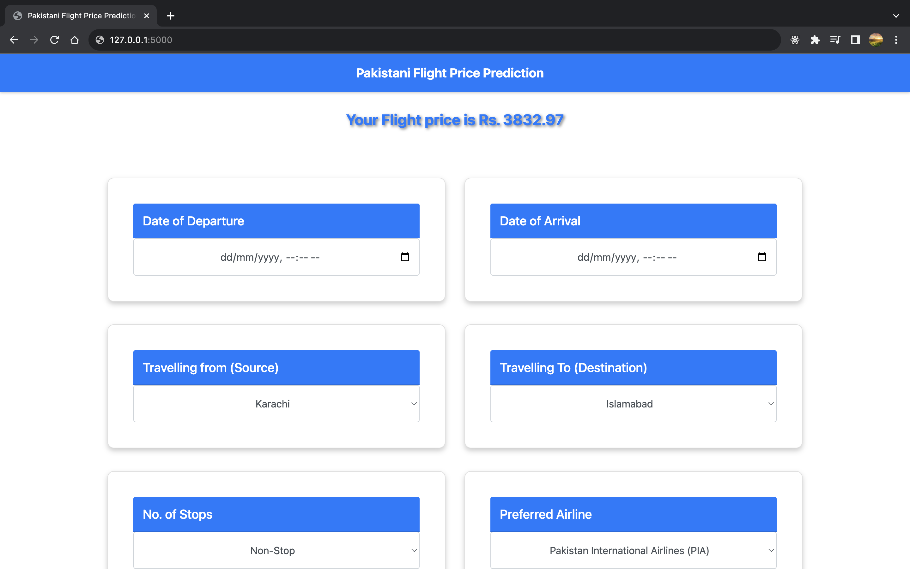

# Flight Fare Prediction

- Flight fare prediction is a classical problem of time series forecasting that finds trends in past observations to outline the future.
- Many popular flight booking websites today, including Google Flights, showcase important insights on:

  - Current fare status: high, low, or fair.
  - Past fare trends, upcoming future trends, and.
  - Helps decide the right time to book a flight ticket.
- In this project, we are going to build a Python Flight Fare Prediction App that returns the fare prediction for a given set of travel details, like: departure date, arrival date, departure city, arrival city, stoppages, and the airline carrier.

## App Functionality



## Steps to run Flight Fare App - on Windows

* Prerequisites: [Python 3.9](https://www.python.org/downloads/) (ensure Python is added to [PATH](https://medium.com/co-learning-lounge/how-to-download-install-python-on-windows-2021-44a707994013)) + [Git](https://git-scm.com/downloads)

1. **Clone the Repository:**

   - Use this command to copy the project files from GitHub to your computer:

   ```bash
   git clone https://github.com/ameer-ali-jamali/flight-price-prediction.git
   ```
2. **Install Virtual Environment:**

   - This command installs a tool called "virtualenv" that helps manage project dependencies.

   ```bash
   pip install virtualenv
   ```
3. **Create and Activate a Virtual Environment:**

   - A virtual environment keeps your project's Python and its libraries separate from your system.
   - Create a virtual environment named "env":

   ```bash
   virtualenv env
   ```

   - Activate the virtual environment:

   ```bash
   .\env\Scripts\activate
   ```

   (On Windows, use `.env\Scripts\activate`)
4. **Install Project Dependencies:**

   - This command installs all the libraries needed for the project:

   ```bash
   pip install -r .\requirements.txt
   ```
5. **Run the Flight Fare Prediction App:**

   - Start the project with this command:

   ```bash
   python app.py
   ```
6. **Deactivate the Virtual Environment:**

   - When you're done with your project, run this to exit the virtual environment:

   ```bash
   deactivate
   ```

## Steps to Run Flight Fare App - on macOS

* Prerequisites: [Python 3.9](https://www.python.org/downloads/) (ensure Python is added to [PATH](https://medium.com/co-learning-lounge/how-to-download-install-python-on-windows-2021-44a707994013)) + [Git](https://git-scm.com/downloads)

1. **Clone the Repository:**

   - Open Terminal.
   - Navigate to your desired working directory.
   - Use the following command to clone the GitHub repository:
     ```bash
     git clone https://github.com/ameer-ali-jamali/flight-price-prediction.git
     ```
2. **Navigate to the Project Directory:**

   - Move to the project working directory (cloned repo folder).
3. **Create and Activate a Virtual Environment:**

   - Create a virtual environment named "env":
     ```bash
     python -m venv env
     ```
   - Activate the virtual environment:
     ```bash
     source env/bin/activate
     ```
4. **Install Project Dependencies:**

   - Install the required project dependencies:
     ```bash
     pip install -r requirements.txt
     ```
5. **Run the Flight Fare Prediction App:**

   - Start the application:
     ```bash
     python app.py
     ```
6. **Deactivate the Virtual Environment:**

   - When you're done, deactivate the virtual environment:
     ```bash
     deactivate
     ```

### Important Note for Python Version

If you encounter issues with Python version commands, such as `python --version` not working, please try using `python3 --version` instead. Python 2 and Python 3 coexist on many systems, and the commands may vary depending on your Python installation. You can check the available Python versions with the following commands:

```bash
python --version
python3 --version
```

### Bug / Feature Request

If you find a bug or have a feature request, kindly open an issue [here](https://github.com/ameer-ali-jamali/flight-price-prediction/issues) by including details about the issue and your expected result.

### Important Links:

* [Dataset](https://www.kaggle.com/datasets/nikhilmittal/flight-fare-prediction-mh)
* [Project Folder on Drive](https://drive.google.com/drive/folders/1vnapi048bbmoXyoxOLLX6W_tA6a1uQ9w?usp=sharing)
